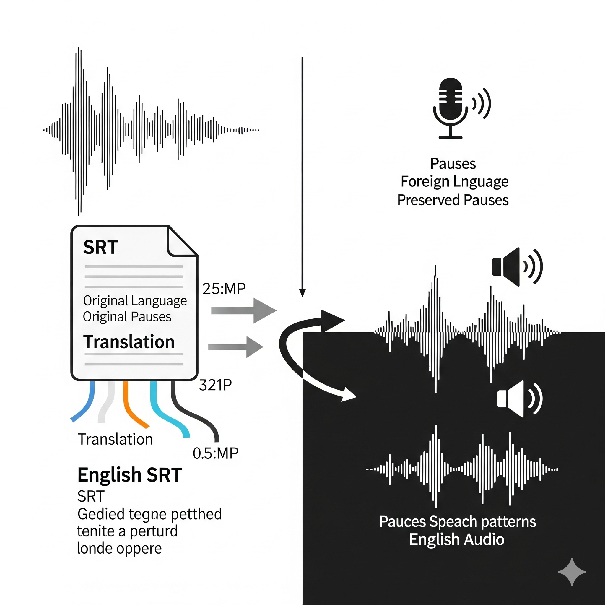

# srt-to-audio-windows-tts
Translate audio to english.
Transform subtitles to timed audio.

## 🆕 Enhanced Features
- **Alternative Language Model Approach**: Use OpenAI TTS for advanced text-to-speech
- **Production-Grade Open-Source TTS**: Use ChatterboxTTS for high-quality voice synthesis
- **Whisper TXT Processing**: Process Whisper's .txt output directly (most straightforward format)
- **Enhanced Error Handling**: Comprehensive logging with condition variable assignment
- **Configurable TTS Methods**: Choose between Edge TTS, OpenAI TTS, and ChatterboxTTS

📖 See [ENHANCED_FEATURES.md](ENHANCED_FEATURES.md) for detailed documentation on new capabilities.

# Origin
100% AI Generated with Microsoft Copilot and Google Gemini

# Quick Start (Automated)

## TLDR; 
```powershell
$env:TTS_METHOD="chatterbox_tts" ; .\run_pipeline.ps1 -InputAudioFile "your_audio.mp3"
```

## Option 1: PowerShell Script (Recommended)
Run the entire pipeline with a single command:

**Windows (PowerShell):**
```powershell
.\run_pipeline.ps1 -InputAudioFile "your_audio.mp3"
```

**Windows (Command Prompt):**
```cmd
run_pipeline.bat your_audio.mp3
```

**Linux/macOS (Bash):**
```bash
./run_pipeline.sh your_audio.mp3
```

### Advanced Usage
```powershell
# Use different Whisper model
.\run_pipeline.ps1 -InputAudioFile "audio.wav" -WhisperModel "large"

# Specify custom output filename
.\run_pipeline.ps1 -InputAudioFile "audio.mp3" -OutputAudio "my_result.mp3"

# Keep intermediate files for debugging
.\run_pipeline.ps1 -InputAudioFile "audio.mp3" -KeepIntermediateFiles
```

### Cross-Platform Examples
```bash
# Linux/macOS
./run_pipeline.sh my_audio.mp3 large custom_output.mp3

# Windows Command Prompt
run_pipeline.bat my_audio.wav medium result.mp3
```

### Prerequisites
The script will check for these dependencies and guide you through installation:
- **Python 3.7+** (Python 3.11 optimal) - Download from [python.org](https://python.org)
- **FFmpeg** - Download from [ffmpeg.org](https://ffmpeg.org) or install via package manager
- **OpenAI Whisper** - Install with: `pip install openai-whisper`
- **Python packages** - Install with: `pip install srt edge-tts`
- **ChatterboxTTS** (optional) - Install with: `pip install chatterbox-tts`

## Option 2: Manual Steps

1. Generate srt from audio file using OpenAI Whisper:

```bash
whisper .\ReelAudio-24214.mp3 --task translate --model medium
```

2. Put generated english subtitles inside your_subtitles.srt

3. Run script to generate english audio
```bash
python .\srt_to_timed_audio.py
```

# Features

- 🚀 **One-Command Automation**: Complete pipeline in a single command
- 🖥️ **Cross-Platform**: Works on Windows, Linux, and macOS
- 🔍 **Dependency Checking**: Automatically validates required tools
- 🎛️ **Configurable**: Choose Whisper model and output filename
- 🧹 **Clean Output**: Optionally removes intermediate files
- 🎨 **Colored Output**: Clear visual feedback during processing
- ⚡ **Error Handling**: Detailed error messages and troubleshooting
- 📖 **Multiple Interfaces**: PowerShell, Batch, and Bash scripts available

# Pipeline Steps

1. **Audio → SRT**: Uses OpenAI Whisper to transcribe and translate audio to English subtitles
2. **SRT → Timed Audio**: Converts subtitles to speech using configurable TTS (Edge TTS, OpenAI TTS, or ChatterboxTTS)
3. **Audio Assembly**: Uses FFmpeg to create properly timed final audio file




